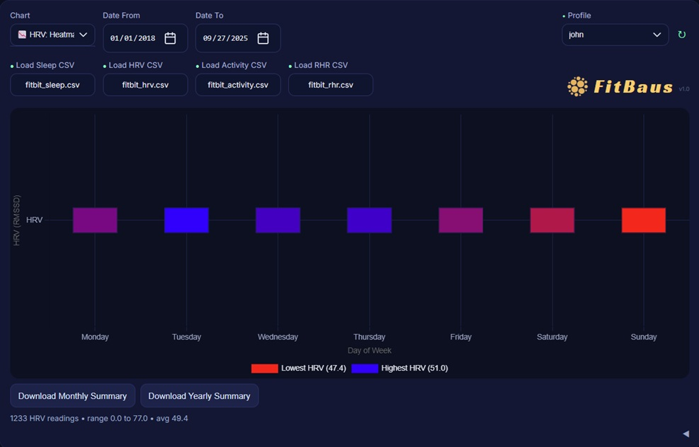
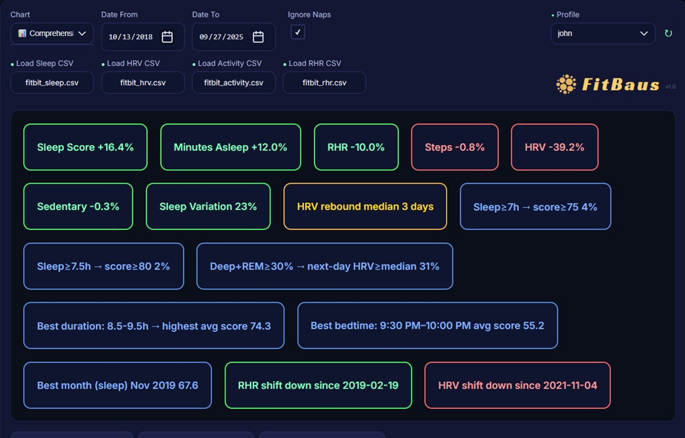
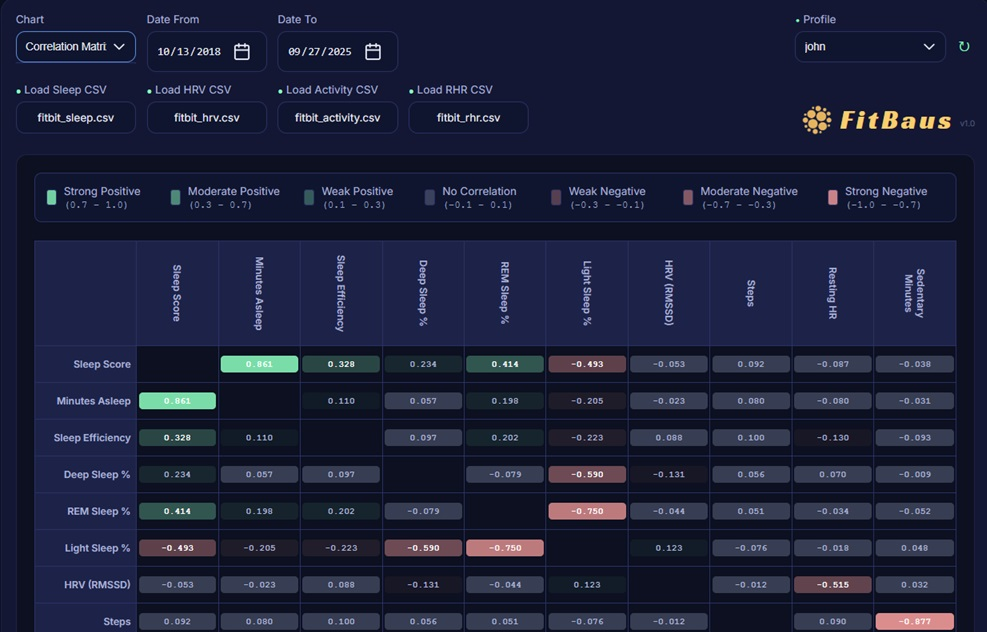
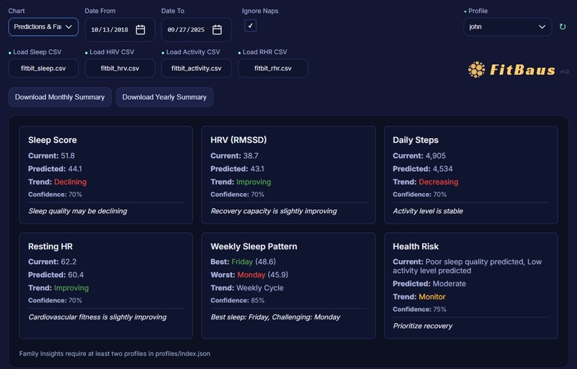
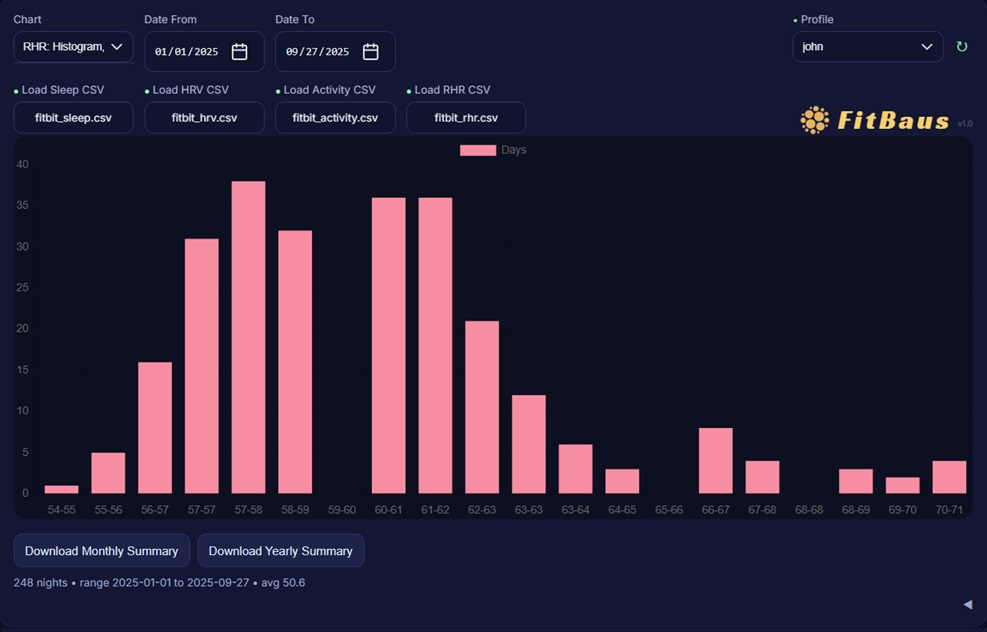
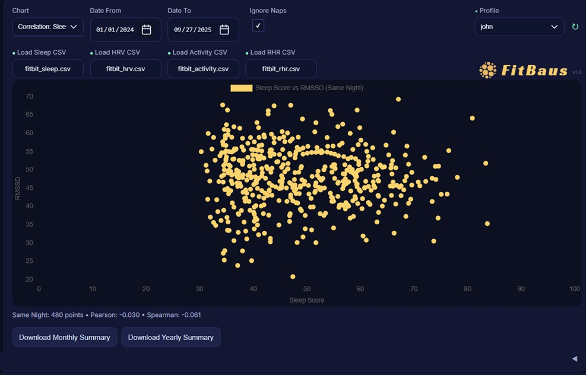

## a comprehensive data analytics dashboard for Fitbit

FitBaus is web-based dashboard for analyzing your Fitbit health and fitness data with beautiful visualizations, trend analysis, and comprehensive analytics. This project is not affiliated with Fitbit® or Google®


|  |  |  |
|---------|---------|---------|
|  |  |  |

## 🚀 Features

- **Multiple Data Views**: Steps, Sleep Score, Minutes Asleep, Heart Rate Variability (HRV), Resting Heart Rate (RHR)
- **Interactive Charts**: Line charts, bar charts, histograms, and scatter plots
- **Time Period Analysis**: Daily, Monthly, and Yearly views
- **Advanced Analytics**: Comprehensive analytics with correlation analysis
- **Data Export**: Download charts and data as CSV files
- **Multi-Profile Support**: Manage multiple Abit accounts
- **Beautiful UI**: Modern, responsive design with dark theme

## 📋 Prerequisites

Before you begin, ensure you have:

1. **Docker Desktop** installed on your system (recommended) OR **Python 3.7+** for local setup
2. **A Fitbit account** with a compatible device
3. **A Fitbit Developer App** (you'll create this in Step 1)

## 🔧 Setup Instructions

### Option A: Docker Setup (Recommended)

**Prerequisites:**
- Docker Desktop installed on your system
- A Fitbit Developer App (see Step 1 below)

**Quick Start with Docker:**

1. **Create a Fitbit Developer App:**
   - Go to [https://www.fitbit.com/dev](https://www.fitbit.com/dev)
   - Sign in with your Fitbit account
   - Click **"Register an App"**
   - Fill in the required information:
     - **Application Name**: `FitBaus` (or any name you prefer)
     - **Application Type**: `Personal`
     - **OAuth 2.0 Application Type**: `Client`
     - **Redirect URL**: `http://localhost:8080/callback`
     - **Default Access Type**: `Read-Only`
   - Click **"Register"**
   - **Important**: Copy and save your **Client ID** and **Client Secret** - you'll need these in the next step

2. **Clone and navigate to the project:**
   ```bash
   git clone <your-repo-url>
   cd fitbaus
   ```

3. **Build and run with Docker Compose:**
   ```bash
   docker-compose up --build
   ```
   **Note**: This will start the web server automatically. You'll need to open a **new terminal window/tab** for the next step.

4. **Access the container** (in a new terminal):
   ```bash
   docker exec -it fitbaus-app bash
   ```
   You should now see a prompt like: `root@cf3bf4c0e3e0:/app#`

5. **Create a profile and authenticate:**
   ```bash
   # Create a profile (replace 'myprofile' with your desired name)
   python auth/authorize_fitbit.py --profile myprofile
   ```
   
   **Alternative - Run without parameters for guidance:**
   ```bash
   # Run without parameters to see usage guidance and options
   python auth/authorize_fitbit.py
   ```
   This will show you the correct syntax and offer to continue with a "default" profile for single-user setups.
   
   **Note**: In Docker, the browser won't open automatically. You'll see instructions like:
   ```
   Opening browser for Fitbit login...
   
   Instructions:
   1. Complete the login process in your browser
   2. You'll be redirected to a URL that looks like:
      https://localhost:8080/callback?code=XXXXX
   3. Copy the ENTIRE redirected URL and paste it below
   ```
   
   **What to do:**
   1. **Look for the authorization URL** in the terminal output (it will be displayed after "Opening browser for Fitbit login...")
   2. **Copy and paste** that URL into your browser's address bar
   3. **Complete** the login and authorization process
   4. **Important**: The Fitbit page will ask you to approve permissions for:
      - Sleep data
      - Heart rate data  
      - Activity and exercise data
      - Profile information
   **Make sure to click "Allow All" to grant all permissions**
   5. **Copy the entire redirected URL** from your browser's address bar (including `?code=XXXXX`)
   6. **Paste it** back into the terminal when prompted

6. **Fetch your data:**
   ```bash
   # Fetch data for your profile
   python fetch/fetch_all.py --profile myprofile
   ```
   
   **Note**: The fetch process may take several minutes and will show progress indicators. You'll see:
   - `[1/4] Starting fetch_steps.py...`
   - `[2/4] Starting fetch_rhr_data.py...`
   - `[3/4] Starting fetch_hrv_data.py...`
   - `[4/4] Starting fetch_sleep_data.py...`
   
   Each script will fetch data from your Fitbit account and save it to CSV files.

7. **Access the dashboard:**
   - Open http://localhost:9000 in your browser
   - Your data will be persisted in the `profiles/myprofile/csv/` directory

**Troubleshooting**: If you see your local machine's data instead of the Docker container's data, try:
   - Check if you have a local web server running on port 8080: `netstat -an | findstr :8080`
   - Verify the container is serving the right content: `docker exec -it fitbaus-app curl http://localhost:9000`
   - Check what's actually running in the container: `docker exec -it fitbaus-app ps aux`
   - Verify the web server is running: `docker exec -it fitbaus-app netstat -tlnp | grep :9000`

**Docker Benefits:**
- ✅ **Isolated environment** - no Python version conflicts
- ✅ **Easy deployment** - works on any system with Docker
- ✅ **Data persistence** - your data survives container restarts
- ✅ **Consistent setup** - same environment for everyone

### Option B: Local Python Setup

### Step 1: Create a Fitbit Developer App

1. Go to [https://www.fitbit.com/dev](https://www.fitbit.com/dev)
2. Sign in with your Fitbit account
3. Click **"Register an App"**
4. Fill in the required information:
   - **Application Name**: `FitBaus` (or any name you prefer)
   - **Application Type**: `Personal`
   - **OAuth 2.0 Application Type**: `Client`
   - **Redirect URL**: `http://localhost:8080/callback`
   - **Default Access Type**: `Read-Only`
5. Click **"Register"**
6. **Important**: Copy and save your **Client ID** and **Client Secret** - you'll need these in the next step

### Step 2: Install Dependencies

Install the required Python packages:

```bash
pip install requests pandas
```

### Step 3: Create a Profile and Authenticate

**Create a profile** (this organizes your data and tokens):

```bash
# Create a profile (replace 'myprofile' with your desired name)
python auth/authorize_fitbit.py --profile myprofile
```

**Alternative - Run without parameters for guidance:**
```bash
# Run without parameters to see usage guidance and options
python auth/authorize_fitbit.py
```
This will show you the correct syntax and offer to continue with a "default" profile for single-user setups.

**What happens during authentication:**
1. The script will prompt you for your **Client ID** and **Client Secret** from Step 1
2. Your browser will open to Fitbit's authorization page
3. Log in with your Fitbit credentials and authorize the app
4. **Important**: The Fitbit page will ask you to approve permissions for:
   - Sleep data
   - Heart rate data  
   - Activity and exercise data
   - Profile information
   **Make sure to click "Allow All" to grant all permissions**
5. You'll be automatically redirected back to the application
6. The script will save your access tokens to `profiles/myprofile/auth/tokens.json`

**Note**: The first time you run this, you'll need to enter your credentials. They'll be saved for future use.

### Step 4: Fetch Your Data

Once authenticated, fetch your Fitbit data for your profile:

```bash
# Fetch data for your specific profile
python fetch/fetch_all.py --profile myprofile
```

This will download:
- **Steps data** (daily step counts)
- **Sleep data** (sleep scores, minutes asleep, sleep stages)
- **Heart Rate data** (HRV and resting heart rate)

**Data Storage**: Your data is saved as CSV files in the `profiles/myprofile/csv/` directory (profile-scoped storage).

### Step 5: Launch the Dashboard

**Start the Flask web server** (required for loading CSV files and API functionality):

```bash
# Start the Flask server
python server.py
```

**Access the dashboard:**
- Open http://localhost:9000 in your web browser
- The dashboard will load your Fitbit data from the CSV files

**Note**: The default server port is 9000 (both locally and in Docker). You can change it by setting the `PORT` environment variable.

**Note**: You cannot simply open `index.html` directly in your browser because the JavaScript needs to fetch CSV files, which requires a web server due to browser security restrictions.

## 🔄 Daily Usage

### Restarting the Container (Without Losing Data)

If you need to restart the container, your data will be preserved:

```bash
# Stop the container
docker-compose down

# Start it again (your data is preserved)
docker-compose up
```

**If you made changes to docker-compose.yml or Dockerfile**, you need to rebuild:

```bash
# Stop the container
docker-compose down

# Rebuild and start (your data is still preserved)
docker-compose up --build
```

**Your data is safe** because it's stored in the `csv/` and `profiles/` directories on your host machine, which are mounted into the container.

### Refreshing Data

#### **Web Interface (Recommended)**
The easiest way to refresh your data is using the web interface:

1. **Open the dashboard** at http://localhost:9000
2. **Select your profile** from the dropdown
3. **Click the reload icon (🔄)** to the left of the profile dropdown
4. **Wait for completion** - the interface will show real-time progress
5. **Data automatically refreshes** when the fetch completes

#### **Command Line (Alternative)**
You can also fetch data manually via command line:

```bash
# Access the container
docker exec -it fitbaus-app bash

# Fetch new data
python fetch/fetch_all.py --profile myprofile
```

### Multi-Profile Support

**Profile Management** is a key feature that allows you to manage multiple Fitbit accounts or different time periods:

#### **Creating Profiles:**
```bash
# Create a new profile (replace 'profile_name' with your desired name)
python auth/authorize_fitbit.py --profile "profile_name"
```

#### **Profile CLI Options:**
```bash
# Fetch data for a specific profile
python fetch/fetch_all.py --profile "profile_name"

# Fetch data for multiple specific profiles
python fetch/fetch_all.py --profiles "profile1" "profile2" "profile3"

# Fetch data for ALL discovered profiles
python fetch/fetch_all.py --all-profiles

# Use environment variable for default profile
export FITBIT_PROFILE="myprofile"
python fetch/fetch_all.py  # Uses the environment variable
```

#### **Profile Structure:**
Each profile creates its own directory structure:
```
profiles/
├── myprofile/
│   ├── auth/
│   │   ├── tokens.json          # Your access tokens
│   │   └── client.json          # Your app credentials
│   └── csv/                     # Your data files
│       ├── fitbit_activity.csv
│       ├── fitbit_sleep.csv
│       ├── fitbit_hrv.csv
│       └── fitbit_rhr.csv
└── another_profile/
    ├── auth/
    └── csv/
```

**Legacy Mode (Default Profile):**
If you use the "default" profile mode, data is stored in:
```
profiles/
└── default/
    ├── auth/
    └── csv/
```

#### **Profile Benefits:**
- ✅ **Multiple accounts** - manage family members' Fitbit data
- ✅ **Data isolation** - each profile has separate data and tokens
- ✅ **Easy switching** - use different profiles for different time periods
- ✅ **Backup friendly** - each profile is self-contained

### Data Management

#### **Resetting Application Data:**
If you need to start fresh or clean up your data:

```bash
# Reset all user data and return to clean state
python reset.py
```

**What gets reset:**
- All profile data (tokens, credentials, CSV files)
- All user-generated content
- Returns application to initial state

**What's preserved:**
- Application code and configuration files
- Docker setup and requirements

**Safety features:**
- Confirmation prompt before deletion
- Clear warning about data loss
- Usage instructions when run without parameters

## 📊 Dashboard Features

### Chart Types

1. **Steps**: Daily step counts with histogram analysis
2. **Sleep Score**: Sleep quality scores with distribution analysis
3. **Minutes Asleep**: Sleep duration tracking
4. **HRV**: Heart Rate Variability analysis
5. **RHR**: Resting Heart Rate trends
6. **Comprehensive Analytics**: Advanced correlation and trend analysis
7. **Predictions & Family Insights**: AI-powered health predictions and family wellness analysis
8. **Life Events**: Personal event tracking with health correlation analysis

### View Options

- **Daily View**: Shows individual day data points
- **Monthly View**: Aggregated monthly averages
- **Yearly View**: Year-over-year comparisons

### Interactive Features

- **Date Range Selection**: Filter data by custom date ranges
- **Data Previews**: Expandable tables showing raw data
- **Export Options**: Download charts and data as CSV files
- **Trend Analysis**: Linear regression trend lines
- **Histogram Analysis**: Distribution analysis for steps and sleep scores
- **Profile Selection**: Dropdown to switch between different user profiles
- **Sleep Histogram Download**: Export sleep score distribution data as CSV
- **Comprehensive Analytics**: Advanced correlation analysis with downloadable summary
- **Predictions & Family Insights**: AI-powered health predictions with confidence scores and family wellness analysis
- **Life Events Tracking**: Personal event logging with sentiment analysis and health correlation

### Advanced Features

#### **Predictions & Family Insights**
The Predictions & Family Insights feature provides AI-powered health forecasting and family wellness analysis:

**Individual Predictions:**
- **Sleep Score Predictions**: 7-day forecasts based on recent trends with confidence scores
- **HRV Predictions**: Heart Rate Variability forecasting with trend analysis
- **Steps Predictions**: Daily step count projections with activity insights
- **RHR Predictions**: Resting Heart Rate trend predictions
- **Weekly Pattern Analysis**: Identifies recurring weekly health patterns
- **Health Risk Assessment**: Comprehensive risk evaluation based on multiple metrics

**Family Insights (Multi-Profile):**
- **Family Wellness Dashboard**: Compare health metrics across family members
- **Shared Fatigue Detection**: Identifies when multiple family members show stress signals
- **Bedtime Correlation Analysis**: Compares sleep patterns between family members
- **Burnout Risk Assessment**: Family-wide stress and fatigue monitoring
- **Health Trend Comparison**: Side-by-side analysis of family health trends

**Requirements:**
- Minimum 7 days of data for predictions
- 2+ profiles required for family insights
- Data automatically filtered by selected date range

#### **Life Events**
The Life Events feature allows you to track personal events and correlate them with your health data:

**Event Management:**
- **Event Logging**: Add personal events with dates and sentiment (positive, negative, neutral)
- **Date Range Integration**: Events are automatically filtered by your selected date range
- **Profile-Specific Storage**: Each profile maintains its own event history
- **Persistent Storage**: Events are saved locally and persist between sessions

**Health Correlation:**
- **Visual Timeline**: Events are displayed alongside your health data
- **Sentiment Analysis**: Track how different types of events affect your health metrics
- **Pattern Recognition**: Identify correlations between life events and health trends
- **Data Export**: Export event data for external analysis

**Usage:**
1. Select "Life Events" from the Chart dropdown
2. Add events using the form (Date, Event Name, Sentiment)
3. Events are automatically filtered by your date range selection
4. View events alongside your health data for correlation analysis

## 🛠️ Troubleshooting

### Common Issues

**Authentication Problems:**
- Ensure your redirect URL in the Fitbit app matches exactly: `https://localhost:8080/callback`
- Check that your Client ID and Client Secret are correct
- Make sure you've authorized the app in your Fitbit account
- If authorizing secondary user, the authorization script may have to be run a second time for it to succeed. 

**Data Fetching Issues:**
- Verify your Fitbit device has synced recent data
- Check your internet connection
- Ensure your access tokens haven't expired (run authentication again if needed)

**Dashboard Not Loading:**
- Make sure you've fetched data first using `fetch_all.py`
- Check that CSV files exist in the `profiles/[profile_name]/csv/` directory
- Verify the correct profile is selected in the dropdown
- Try refreshing your browser

**Profile Management Issues:**
- If you can't see your profile data, check the profile dropdown in the UI
- Ensure you're using the same profile name for authentication and data fetching
- Use `python auth/authorize_fitbit.py --sync-profiles` to refresh the profile list
- Check that profile directories exist in the `profiles/` folder

**Data Reset Issues:**
- Use `python reset.py` to clean up all user data and start fresh
- The reset script will ask for confirmation before deleting data
- Run without parameters to see usage instructions: `python reset.py`

### Getting Help

If you encounter issues:

Feel free to reach out to me at: markraidc@gmail.com

## 📁 Project Structure

```
fitbaus/
├── auth/                          # Authentication scripts
│   ├── authorize_fitbit.py
│   ├── refresh_token.py
│   └── client.json                # Default client credentials (if used)
├── fetch/                         # Data fetching scripts
│   ├── fetch_all.py              # Main data fetcher
│   ├── fetch_steps.py
│   ├── fetch_sleep_data.py
│   ├── fetch_hrv_data.py
│   └── fetch_rhr_data.py
├── profiles/                     # Multi-profile support (primary data storage)
│   └── [profile_name]/
│       ├── auth/
│       │   ├── tokens.json       # Your access tokens (auto-generated)
│       │   └── client.json       # Your app credentials (auto-generated)
│       └── csv/                  # Your data files
│           ├── fitbit_activity.csv
│           ├── fitbit_sleep.csv
│           ├── fitbit_hrv.csv
│           └── fitbit_rhr.csv
├── common/                       # Shared utilities
├── generate/                     # Chart generation scripts
├── index.html                    # Main dashboard
├── script.js                     # Dashboard logic
├── style.css                     # Styling
├── reset.py                      # Data reset utility
├── requirements.txt              # Python dependencies
├── Dockerfile                    # Docker configuration
├── docker-compose.yml            # Docker Compose setup
└── README.md                     # This file
```

## 🔒 Privacy & Security

- **Local Data**: All your data is stored locally on your computer
- **No Cloud Storage**: Your Fitbit data never leaves your device
- **Secure Authentication**: Uses OAuth 2.0 for secure API access
- **Token Management**: Access tokens are stored securely and can be refreshed automatically

## 📈 Data Retention & API Limits

- **Historical Data Access**: The Fitbit API provides access to your historical data without strict time limitations (varies by data type and device)
- **Rate Limiting**: 150 API requests per hour per user 
- **Rate Limit Headers**: The API includes helpful headers to monitor usage:
  - `Fitbit-Rate-Limit-Limit`: Total requests allowed per hour
  - `Fitbit-Rate-Limit-Remaining`: Requests remaining before hitting the limit
  - `Fitbit-Rate-Limit-Reset`: Seconds until the limit resets
- **Automatic backoff (what you’ll see during fetches)**:
  - The fetch scripts automatically respect Fitbit’s rate-limit headers. When the headers indicate you’re at the limit, the scripts pause and show a live countdown (mm:ss), then resume.
  - On HTTP 429 responses, the scripts wait for the header-provided reset time if present; otherwise they wait until the next top of the hour (plus a small buffer) before retrying.
  - Even when a request succeeds, the scripts may still throttle briefly if the response headers suggest a reset is imminent. This avoids hitting the limit on subsequent requests.
  - Token refresh requests also use exponential backoff and honor `Retry-After` if provided.
  - Seeing “Retrying in mm:ss” or “Waiting until HH:00:SS” is expected behavior, not a hang.
- **Data Backup**: Consider backing up your `csv/` directory to preserve your data
- **Regular Fetching**: Run fetch scripts regularly to build up your historical dataset

## 🎯 Tips for Best Results

1. **Regular Data Fetching**: Run `fetch_all.py` daily or weekly to maintain a complete dataset
2. **Consistent Wear**: Wear your Fitbit device consistently for accurate data
3. **Sync Regularly**: Ensure your Fitbit device syncs with the app regularly
4. **Profile Management**: Use different profiles for different family members or time periods

## 📝 License

This project is for personal use. Please respect Fitbit's API terms of service and data usage policies.

## Self-Hosting with Docker (Quick Guide)

The repository includes a Dockerfile and docker-compose.yml for running FitBaus locally on your server.

- Build and run
  - `docker compose up -d` (serves the UI on http://localhost:9000)
  - Data persists in `./profiles` (tokens, per‑profile data) and `./csv`.

- Authorize a profile
  - Open the app (http://localhost:9000) → Profile Management → Create a profile.
  - Use the built‑in authorization flow. Manual mode works everywhere (open URL, paste code). Background capture is optional (see below).

- Fetch and explore
  - Press ↻ to fetch data, then switch charts and ranges.

- Container health & user
  - The image runs as a non‑root `app` user.
  - A Docker `HEALTHCHECK` hits `/api/health` for status.

- Optional background OAuth
  - Requires a local HTTPS redirect such as `https://localhost:8080/callback`.
  - In compose, uncomment `8080:8080` and set `FITBIT_REDIRECT_URI`, `FITBIT_SSL_CERT`, `FITBIT_SSL_KEY`; mount your `./certs` directory accordingly.

- Production Deployment
  - The Docker image uses Gunicorn WSGI server (not Flask dev server) for production.
  - Configured with 2 workers, proper timeouts, and request limits for stability.
  - Uses UTC timezone by default; set `TZ` environment variable to match your timezone.
  - Health check endpoint available at `/api/health` for monitoring.
  - For high-traffic deployments, consider using a reverse proxy (Nginx/Caddy) with load balancing.

- Security
  - Do not expose the service directly to the internet without a reverse proxy and authentication.
  - Recommended: Proxy with HTTPS (Caddy/Traefik/Nginx) and basic auth or IP allowlisting.
  - Tokens are stored in `profiles/<id>/auth/tokens.json`; keep this directory private and backed up.
